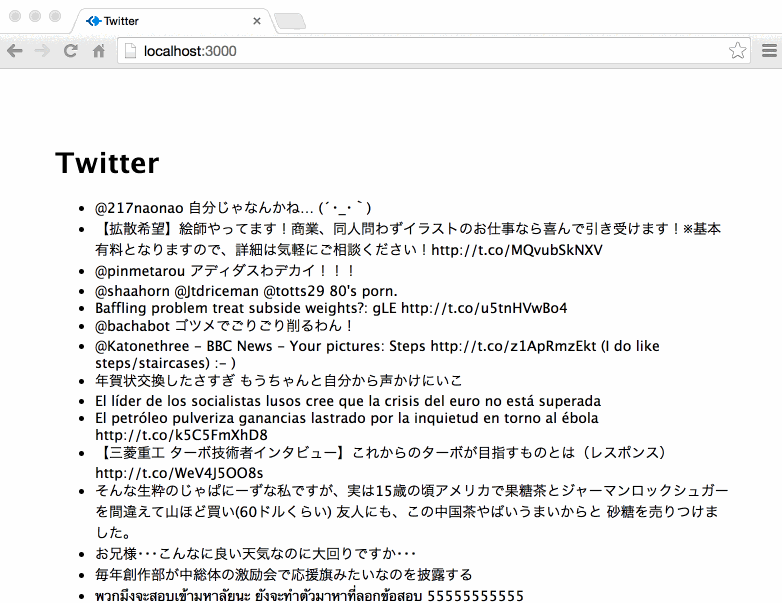

# Twitter App

> Lost time is never found again.
>
> &mdash; Benjamin Franklin

A twitter streaming app, built with [socket.io](http://socket.io/), [express](http://expressjs.com/) and Twitter Streaming API.



## Installation

Install dependencies:

```
$ npm install
```

To use Twitter streaming API, you'll need to obtain access token key and secret from [Twitter Application Management Site][twitterapps], and insert keys  to `config.json`.

Start server:

```
$ node app.js
```

[twitterapps]: https://apps.twitter.com/